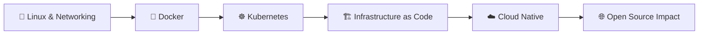

<!-- ============ HEADER BANNER (3D-style) ============ -->
<p align="center">
  
</p>

<p align="center">
  <a href="https://git.io/typing-svg">
    
  </a>
</p>

<p align="center">
  
  
  
  
  
</p>

---

## 👨‍💻 About Me

Computer Science & Engineering student from **Assam, India**, passionate about **Cloud, DevOps, and Cloud Native technologies**. I enjoy building infrastructure, automating workflows, working with containers, and understanding how modern applications are deployed and managed at scale.

I'm actively contributing to **open source** and growing through real-world collaboration.

```yaml
# profile.yaml
apiVersion: v1
kind: Engineer
metadata:
  name: Dhritiraj Nath
  location: Assam, India
spec:
  studying: Computer Science & Engineering
  focus: [Cloud, DevOps, Kubernetes, Docker, CI/CD]
  learning: [Linux, Networking, Cloud Infrastructure, Infrastructure as Code]
  interests: [Cloud Native, Kubernetes Ecosystem, Open Source]
  goal: "Become a strong Cloud/DevOps engineer through practical projects"
status:
  state: Building & Learning 🚀
```

---

## 🧭 Roadmap



---

## 🛠️ Tech Stack

<p align="center">
  
</p>

> 🔧 Swap icons as your stack evolves. Full icon list: [skillicons.dev](https://skillicons.dev)

| Domain | Tools |
| --- | --- |
| ☁️ **Cloud** | AWS *(learning)* |
| 📦 **Containers & Orchestration** | Docker, Kubernetes |
| 🔁 **CI/CD** | GitHub Actions |
| 🏗️ **IaC** | Terraform, Ansible *(learning)* |
| 🐧 **Systems** | Linux, Bash, Networking |
| 🧪 **Languages** | Python, JavaScript, TypeScript |

---

## 🌐 Open Source Contributions

| Project | Contribution | Status |
| --- | --- | --- |
| [**Kestra**](https://github.com/kestra-io/kestra) | Added unit tests for the topology status helper, improving frontend test coverage and reliability across execution states | ✅ **First PR Merged** |
| [**Meshery**](https://github.com/meshery/meshery) | Created my first design and began exploring the Cloud Native ecosystem through community participation | 🎨 **Design Pioneer** |

---

## 📊 GitHub Stats

<p align="center">
  
  
</p>

<p align="center">
  
</p>

<!-- 3D contribution graph: set up the github-profile-3d-contrib Action (see notes), then uncomment -->
<!--
<p align="center">
  
</p>
-->

---

## 🎯 Current Focus

**Cloud & DevOps → Kubernetes → Cloud Native → Open Source**

- 🔭 Building hands-on projects around containers, CI/CD, and automation
- 🌱 Deepening Linux, Networking, Cloud Infrastructure, and IaC
- 🤝 Looking to contribute to Open Source and Cloud Native communities

---

## 📫 Let's Connect

<p align="center">
  <a href="https://www.linkedin.com/in/dhritiraj-nath-6b2769319/">
    
  </a>
  <a href="mailto:techwithraj@gmail.com">
    
  </a>
</p>

<p align="center">
  
</p>
